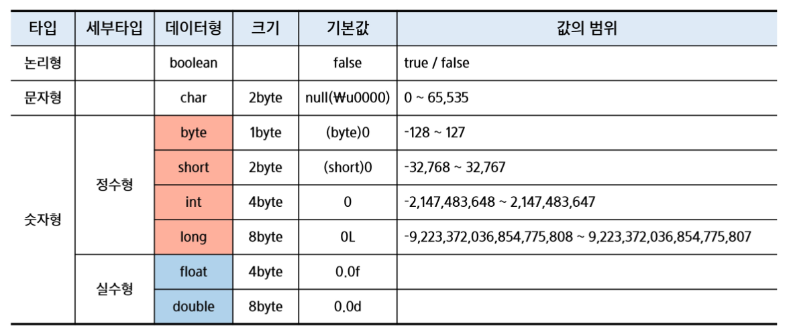
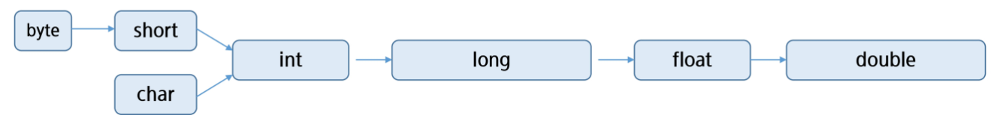
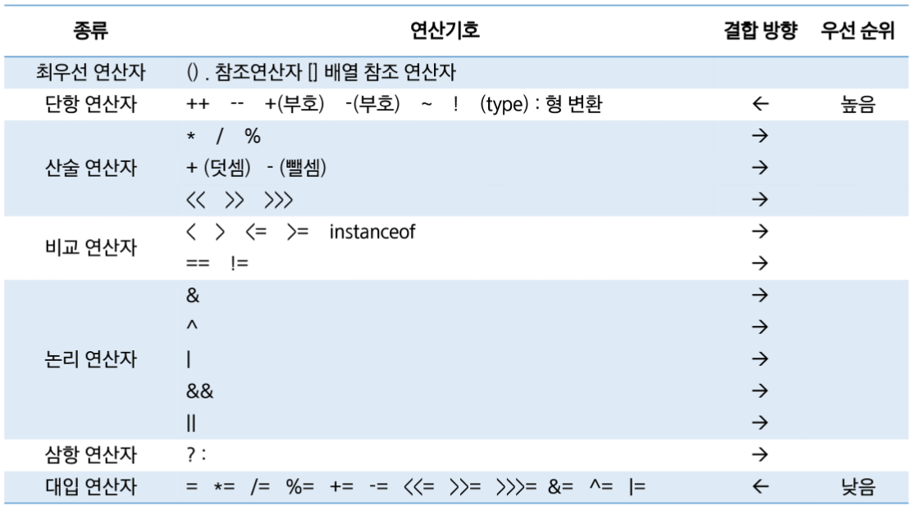

# Java 기본 문법
## Java 기본
### 운영체제와 프로그램
- 프로그램 (Program)
    - 컴퓨터에서 실행될 때 특정 작업을 수행하는 일련의 명령어들의 집합
- 운영체제 (Operating System, OS)
    - 시스템 소프트 웨어

### 컴퓨터의 자료표현
- 비트 (Bit)
- 바이트 (Byte) : 8비트
- 2진수 (Binary)

### 자바 가상 머신 (JVM)
- 자바 바이트코드를 실행할 수 있는 주체
- 모든 바이트고드는 플랫폼에 독립적이며 모든 JVM은 자바 가상 머신 구격에 정의된 대로 자바 바이트코드를 실행
- JRE : 자바 실행 환경
- JDK : 자바 개발 도구

### Hello World
```java
public class Hello {
	public static void main(String[] args) {
		System.out.println("Hello World!");
	}
}
```

### main method
- java를 실행 시 가장 먼저 호출되는 부분
- Application에서 main() 메서드가 없다면 절대로 실행될 수 없음
- Application의 시작 -> 특정 클래스의 main() 실행
- 형태 : 고정된 형태
```java
	public static void main(String[] args) { }
```

### 주석(Comment)
```java
// 기호가 등장한 순간 부터 끝까지 해당 줄을 주석 처리

/*
* 해당 범위를 주석처리 하겠다
*/

/**
 * Documentation API 위한 주석
 */
```

### 출력문
- print
    - 줄바꿈이 없다
- println
    - 줄바꿈이 들어가있다
- printf
    - %d : 정수
    - %f : 실수
    - %c : 문자
    - %s : 문자열

## 변수와 자료형
### 변수 (Variable)
- 데이터를 저장할 메모리의 위치를 나타내는 이름
- 적절한 메모리 공간을 확보하기 위해서 변수 타입 등장
- 변수 작명 규칙
	- 대소문자 구분
	- 공백 X
	- 숫자 시작 X
	- '$'와 '_'를 변수 이름에 사용할 수 있다. 이 외의 특수 문자는 허용 X
	- 예약어 사용 X
	- 합성어의 경우 주로 camelCase 활용
	- 한글 작명 가능 (권장 X)
### 자료형 (Data Type)
- 기본 자료형과 참조 자료형(기본 자료형 8가지 외 모든 것)
- 기본 자료형: 미리 정해진 크기의 memory size 표현, 변수 자체에 값 저장
#### 

### 변수와 자료형
```java
	public static void main(String[] args) {
		// 변수 선언: 자료형 변수 이름;
		int age;
		// 변수 할당: 변수이름 = 값;
		age = 100;
		// 변수 초기화
		// 선언과 동시에 할당하는 것
		int money = 10000;
    }
```

### 형 변환 (Type Casting)
#### 
- 데이터 형 변환
    - 묵시적(암묵적): Implicit Casting
        1. 범위가 넓은 데이터 형에 좁은 데이터 형을 대입하는 것
        - byte b = 100; int i = b;
    - 명시적: Explicit Casting (데이터 손실 가능성 존재)
        1. 범위가 좁은 데이터 형에 넓은 데이터 형을 대입하는 것
        2. 형 변환 연산자 사용 - (타입) 값;
        - int i = 100; byte b = i; (X) / byte b = (byte)i; (O)

## 연산자
### 연산자 종류
#### 

### 단항 연산자
- 증감 연산자 ++, --
    - 피연산자의 값을 1증가, 감소 시킨다
    - 전위형(prefix) ++i
    - 후위형(postfix) i--
- 부호 연산자 +, -
    - '+' : 숫자가 양수임을 표시
    - '-' : 피연산자의 부호를 반대로 변경한 결과 반환
- 논리 부정 연산자 !
    - 논리 값을 반전
- 비트 부정 연산자 ~
    - 비트 값을 반전
- 형 변환 연산자 (type)

### 산술 연산자
- *, /, %, +, -

### 비교 연산자
- 대소 비교 연산
    - '>', '>=', '<', '<='
- 동등 비교 연산
    - ==, !=
- 객체 타입 비교 연산
    - instanceof
- String 변수 비교
    - equals() 사용

### 논리 연산자
- &&
    - 논리 곱 (AND)
- ||
    - 논리 합 (OR)
- !
    - 논리 부정 (NOT)
#### short circuit evaluation

### 삼항 연산자
- 조건식 ? 식 : 식2
    - 조건식이 참일 경우 식1 수행
    - 조건식이 거짓일 경우 식2 수행

### 복함 대입 연산자
- +=, -=, *=, /=
    - i += 1 -> i = i + 1

## 조건문
### if - else if - else 문
```java
if(조건식) {	
    실행할 문장;
} else if {
    실행할 문장;
} else {
    실행할 문장;
}
```

### switch 문
- 인자로 선택변수를 받아 변수 값에 따라서 실행문이 결정
    - 수식에 올 수 있는 것
        - byte, short, char, int, enum, String
    - break문 없이도 사용 가능
    - default == else
```java
switch(수식) {
    case 값1:
        실행문 A;
        break;
    case 값2:
        실행문 B;
        break;
    default:
        실행문 C;
}
```

## 반복문
### for 문
```java
for(초기화식; 조건식; 증감식) {
    반복 수행할 문장
}
```
```java
// 무한루프
for(;;) {

}
```

### while 문
```java
while (조건식) {
    반복 수행할 문장;
}
```

### do while 문
```java
do {
    // 블록 내용을 먼저 수행 후 조건식 판단
    반복 수행할 문장;
} while (조건식);
```